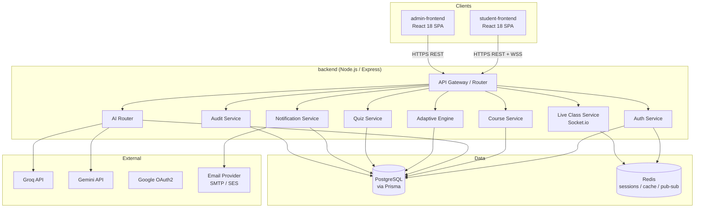
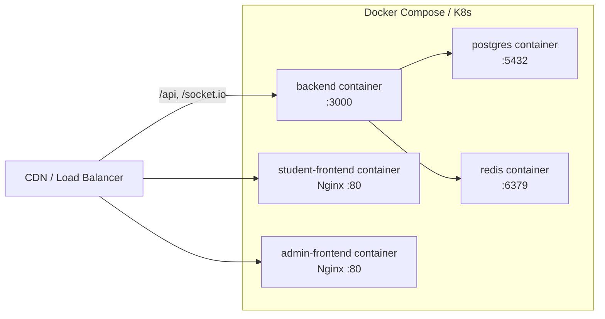

# Design Document: EduVerse AI-Powered Smart Learning Platform

## Overview

EduVerse is a full-stack, AI-augmented learning platform composed of three independently deployable units:

- `backend/` — Node.js + Express REST API + Socket.io signaling server, backed by PostgreSQL (via Prisma ORM) and Redis
- `student-frontend/` — React 18 SPA serving students and instructors (course browsing, AI tutoring, live classes, quizzes, analytics)
- `admin-frontend/` — React 18 standalone SPA serving platform administrators (user management, system health, audit logs)

The platform's distinguishing capabilities are:
1. **Dual-model AI tutoring** — Groq (fast, ≤500 ms) for conversational Q&A, Gemini (deep reasoning, >500 ms) for complex explanations, with automatic routing
2. **Adaptive learning engine** — per-student knowledge graphs, spaced repetition scheduling, and difficulty adjustment
3. **Live face-to-face classes** — WebRTC peer connections brokered by a Socket.io signaling layer
4. **Role-based access control** — three distinct roles (Student, Instructor, Admin) with separate UI surfaces

---

## Architecture

### High-Level System Diagram

### Deployment Architecture

Each unit has its own `Docker